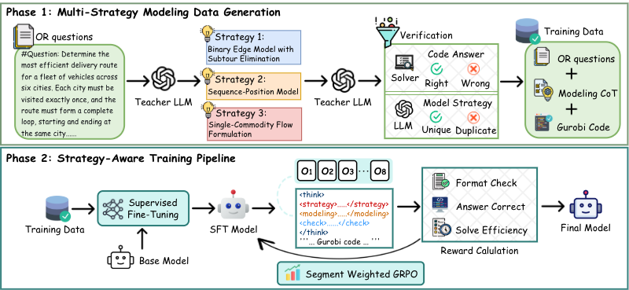
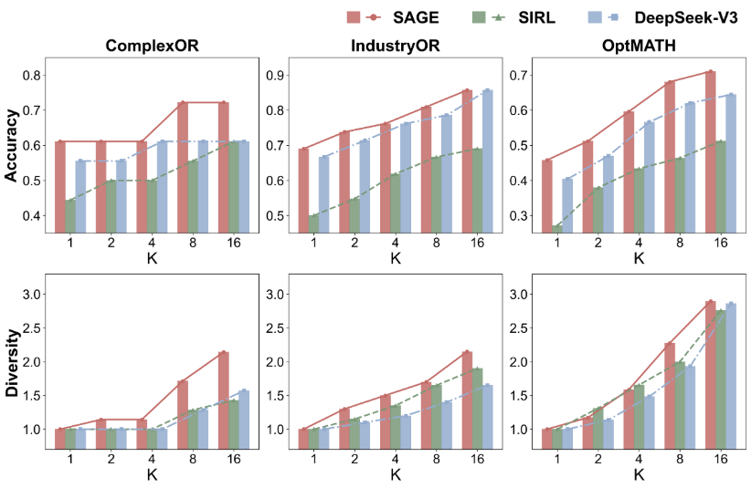
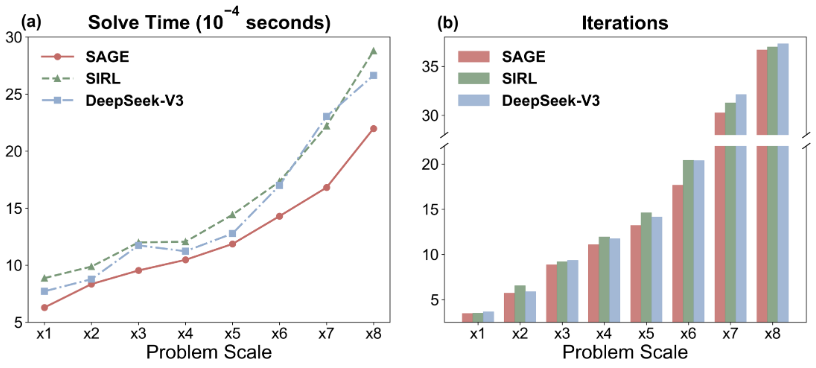

<h2 align="center">
SAGE: Strategy-Aware Optimization Modeling with Reasoning LLMs
</h2>

This repository contains the official code and supplementary materials for the paper:

> **Strategy-Aware Optimization Modeling with Reasoning LLMs**

We propose **SAGE**, a strategy-aware framework for automated optimization modeling that explicitly reasons over *modeling strategy* and optimizes both formulation correctness and solver efficiency using reinforcement learning with solver feedback.

---

## 🧠 Framework Overview

  
  
<em>
  Figure 1: Overview of SAGE.
  </em>

SAGE consists of two training phases:

**Phase 1: Multi-Strategy Data Construction**
- Generate multiple candidate modeling strategies per problem
- Produce strategy-conditioned reasoning and solver code
- Filter incorrect outputs via solver execution
- Deduplicate semantically redundant strategies

**Phase 2: Strategy-Aware Training**
- Supervised fine-tuning on verified multi-strategy data
- Reinforcement learning with **Segment-Weighted GRPO**
- Composite reward over:
  - structured format compliance
  - solver-verified correctness
  - solver efficiency
---

## 🔥 Main Results: Pass@1 Accuracy

**Table 1. Overall Pass@1 accuracy (%) on eight optimization modeling benchmarks.**  
All reproduced baseline results are obtained on the same cleaned benchmark versions used to evaluate SAGE.  
Best results are shown in **bold**, and second-best results are <ins>underlined</ins>.

| Types | Models | NL4OPT | MAMO Easy | NLP4LP | OptiB. | MAMO Complex | CpxOR | IndOR | OptM. | Avg. |
|------|--------|--------|-------------|--------|--------|----------------|-------|--------|-------|------|
| Zero-shot | GPT-4o | 89.2 | 77.2 | 89.9 | 82.9 | 61.3 | 50.0 | 47.6 | 21.1 | 64.9 |
|  | DeepSeek-V3 | 87.8 | 95.2 | 87.6 | 85.1 | 55.9 | 55.6 | 66.7 | 40.4 | 71.8 |
|  | DeepSeek-R1 | 86.4 | 88.1 | 81.5 | 77.4 | 63.9 | 55.6 | 57.1 | 34.9 | 68.1 |
|  | Qwen3-32B | 82.7 | 73.6 | 88.8 | 81.6 | 46.8 | 33.3 | 42.9 | 14.5 | 58.0 |
|  | Qwen2.5-72B | 84.0 | 91.9 | 85.4 | 80.4 | 52.3 | 44.4 | 47.6 | 18.1 | 63.0 |
| Agent-based | Chain-of-Experts | 66.7* | 94.4* | 87.4* | 71.2* | 50.6* | 57.1* | 31.2* | – | – |
|  | OptiMUS | 76.2* | 78.0* | 88.8* | 87.6* | 46.8* | 46.8* | 45.2* | 20.2* | 61.2* |
| Offline | ORLM-L3-8B | 73.8* | 90.4* | 76.4* | 61.8* | 59.5* | 50.0* | 42.9* | 2.6* | 57.2* |
|  | LLMOpt-Q2.5-14B | 80.3* | 89.5* | 73.4* | 53.8* | 44.1* | 35.3* | 29.0* | 12.5* | 52.2* |
| Online-RL | SIRL-Q2.5-7B | 94.8 | 98.0 | 96.6 | 89.6 | 81.1 | 44.4 | 50.0 | 27.1 | 72.7 |
|  | StepORLM-Q3-8B | 96.7 | 95.4 | 97.2 | 88.6 | 79.3 | 50.0 | 52.4 | 13.9 | 71.7 |
| **Online-RL** | **SAGE-DS-14B (Ours)** | **94.3** | **94.7** | **98.9** | **93.8** | **84.7** | **61.1** | **69.0** | **45.8** | **80.3** |

**Key observations**:
- SAGE achieves the **best average performance (80.3%)** among all open-source methods.
- Gains are particularly pronounced on **Complex benchmarks** (MAMO-Complex, ComplexOR, IndustryOR, OptMATH).
- SAGE outperforms its teacher model **DeepSeek-R1**, despite using fewer parameters.

---

## 📈 Pass@K Accuracy & Modeling Diversity

  
  
<em>
  Figure 2: Pass@K accuracy and modeling diversity as K increases on ComplexOR, IndustryOR, and OptMATH.
  </em>

As the sampling budget increases, SAGE continues to:
- Discover more correct formulations
- Explore a broader set of modeling strategies

---

## ⚙️ Solver Efficiency Analysis

  
  
<em>
  Figure 3: Solver efficiency under increasing problem scale (ComplexOR).
  </em>

SAGE consistently produces formulations that:
- Solve faster
- Require fewer solver iterations
- Scale more gracefully as problem size increases
